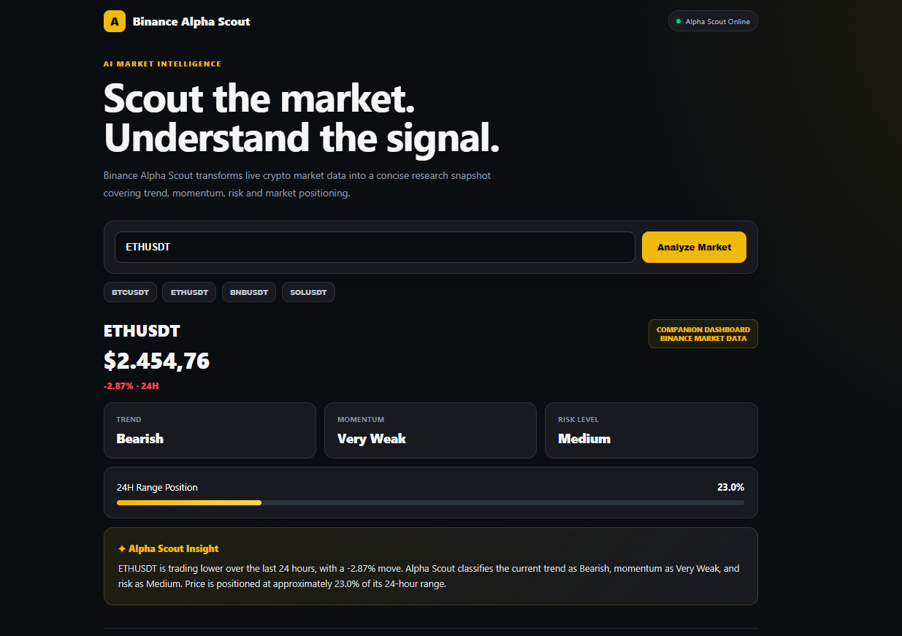
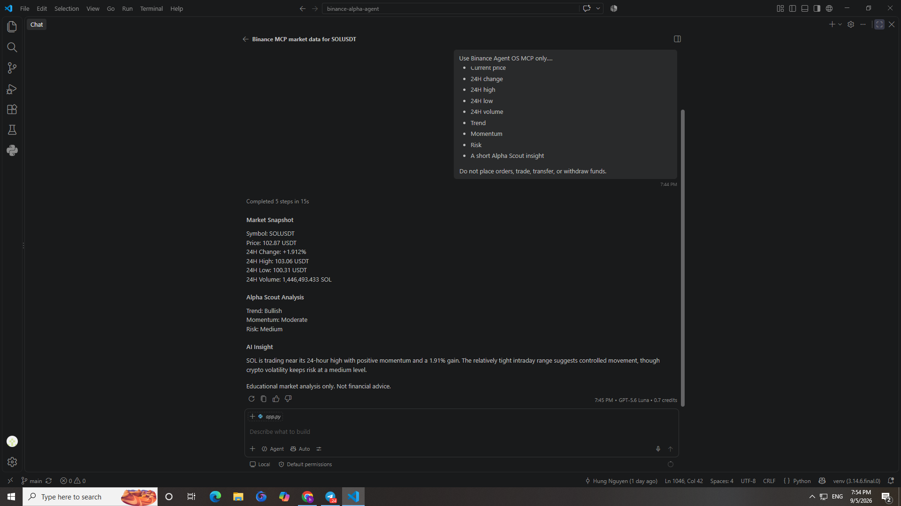

# Binance Alpha Scout

Binance Alpha Scout is an AI-powered crypto market research agent built with **Binance Agent OS** and **Binance MCP**.

It retrieves live Binance market data, evaluates market conditions, and produces a concise research report with trend, momentum, risk, and AI-generated insight.

---

## 🚀 What It Does

Users can ask Alpha Scout to analyze trading pairs such as:

- BTCUSDT
- ETHUSDT
- BNBUSDT
- SOLUSDT

The agent retrieves live Binance market data through Binance Agent OS MCP and generates:

- Current price
- 24H percentage change
- 24H high
- 24H low
- 24H volume
- Trend classification
- Momentum classification
- Risk classification
- Short AI market insight
## 🖥️ Demo

### Alpha Scout Dashboard

A lightweight research dashboard that transforms live Binance market data into a concise market snapshot with trend, momentum, risk, 24-hour range positioning, and Alpha Scout insight.



### 🤖 Binance Agent OS MCP Integration

Alpha Scout integrates with Binance Agent OS through MCP. The example below shows the agent retrieving live SOLUSDT market data through the Binance MCP `spot_ticker24hr` tool and producing a structured market analysis.



> **Safety:** Alpha Scout is currently designed as a read-only market research agent. It does not place orders, transfer assets, or withdraw funds.
---

## 🧠 Architecture

```text
User
  ↓
AI Agent
  ↓
Binance Agent OS
  ↓
Binance MCP
  ↓
Live Binance Market Data
  ↓
Alpha Scout Reasoning
  ↓
Trend / Momentum / Risk
  ↓
AI Market Insight